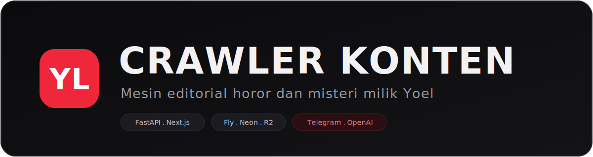
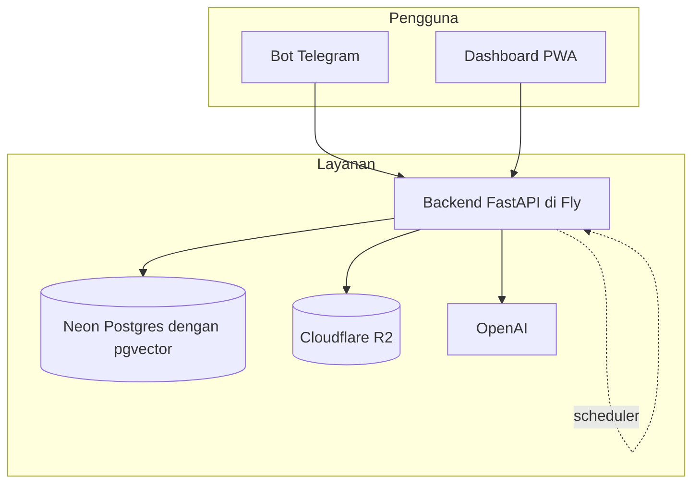
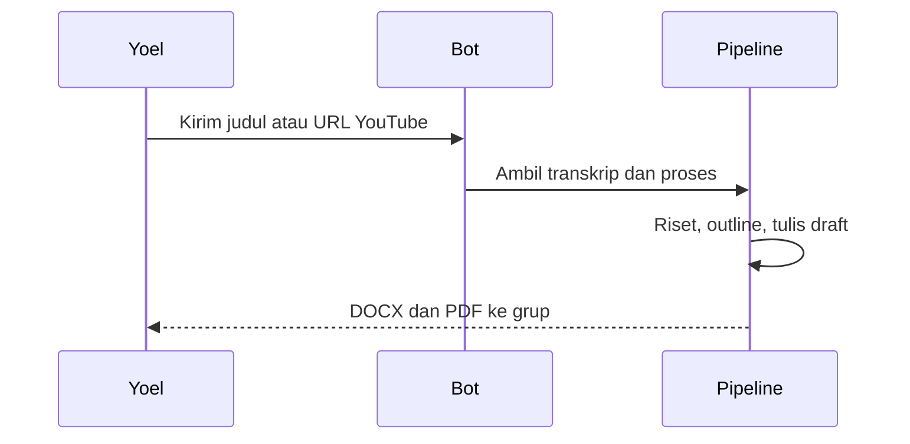

<p align="center">
  
</p>

<p align="center">
  <a href="https://app.netlify.com/projects/yoel-konten/deploys"></a>
</p>

<p align="center">
  
  
  
  
  
</p>

<h3 align="center">Proyek ambisius milik Yoel</h3>

<p align="center">
  Sebuah mesin editorial yang mencari cerita horor dan misteri, menilai kualitasnya,<br>
  mengirim ringkasan ke Telegram untuk disetujui, lalu menulis draft skrip otomatis.
</p>

---

## Apa ini

Crawler Konten adalah asisten produksi pribadi untuk satu kreator. Tujuannya sederhana tapi besar, yaitu memangkas jarak antara menemukan bahan cerita sampai punya draft skrip yang siap direkam. Audio tidak masuk lingkup, karena Yoel merekam suaranya sendiri. Fokus alat ini ada pada tiga hal, yaitu mencari, menilai, dan menulis.

Yang membedakan, alat ini tidak menyalin cerita mentah. Ia mengambil esensi sebuah kisah lalu mengemasnya ulang menjadi naskah horor yang atmosferik dengan suara khas channel, tenang, berat, dan perlahan. Bukan laporan investigasi, bukan rangkuman dokumen.

---

## Alur kerja

```mermaid
flowchart LR
    A[Sumber RSS dan YouTube] --> B[Crawl]
    B --> C[Proses dan skor]
    C --> D[Antrian kandidat]
    D --> E[Digest ke Telegram]
    E -->|Disetujui| F[Riset bukti]
    F --> G[Susun outline]
    G --> H[Tulis draft horor]
    H --> I[Sanitasi teks]
    I --> J[Bangun DOCX dan PDF]
    J --> K[Kirim ke grup]
```



Penilaian memakai tujuh komponen, yaitu engagement, kesegaran, kebaruan, kedalaman naratif, kecocokan horor, keandalan, dan kecocokan audiens. Hasilnya jadi skor akhir dan prioritas A, B, atau C.

---

## Arsitektur



Scheduler internal berjalan dalam proses, mengumpulkan cerita pada siang sampai malam dan mengirim digest dini hari. Bot Telegram memakai webhook, dan hanya pemilik yang memegang akses penuh ke perintah admin.

---

## Permintaan langsung lewat Telegram



Beri sebuah judul atau tautan video, sebut durasi target, dan alat akan mentranskrip lalu mengemas ulang jadi draft. Progresnya bisa dipantau di dashboard.

---

## Tumpukan teknologi

| Lapisan | Teknologi |
| --- | --- |
| Backend | FastAPI, SQLAlchemy async, psycopg3 |
| Basis data | Neon Postgres dengan pgvector |
| Penyimpanan | Cloudflare R2 |
| Model | OpenAI untuk penalaran, embedding, dan transkrip |
| Pesan | Telegram via aiogram dengan webhook |
| Penjadwalan | APScheduler di dalam proses |
| Crawl | trafilatura, selectolax, yt-dlp |
| Frontend | Next.js dengan App Router, Tailwind, PWA |
| Hosting | Fly.io untuk backend, Netlify untuk frontend |

---

## Struktur repo

```text
.
├── backend
│   └── app
│       ├── api          Endpoint dashboard
│       ├── agents       Delivery, pipeline skrip, agen admin
│       ├── crawler      Adapter sumber dan runner
│       ├── llm          Klien model dan prompt
│       ├── notifier     Bot dan helper Telegram
│       ├── services     Progress, sumber, ingest YouTube
│       └── scheduler.py Tugas terjadwal
├── frontend
│   └── src              Aplikasi PWA Next.js
└── docs                 Aset banner dan dokumentasi
```

---

## Menjalankan secara lokal

Backend memerlukan berkas konfigurasi rahasia yang tidak ikut masuk repo. Salin contoh lalu isi nilainya.

```bash
cd backend
cp .env.example .env
pip install .
uvicorn app.main:app --reload
```

Frontend berdiri sendiri dan menunjuk ke alamat backend.

```bash
cd frontend
npm install
npm run dev
```

---

## Konfigurasi

| Kunci | Guna |
| --- | --- |
| OPENAI_API_KEY | Akses model OpenAI |
| DATABASE_URL | Koneksi Neon Postgres |
| R2 credentials | Akses penyimpanan objek |
| TELEGRAM_BOT_TOKEN | Token bot |
| DASHBOARD_TOKEN | Token masuk dashboard |
| YOUTUBE_API_KEY | Statistik dan pencarian video |

Semua rahasia disimpan di luar repo dan tidak pernah dikomit. Lihat berkas SECURITY.md untuk aturan penanganan rahasia dan pelaporan kerentanan.

---

## Penerapan

Backend menerapkan diri otomatis ke Fly setiap ada dorongan ke cabang utama, lewat alur kerja GitHub Actions. Frontend diterapkan ke Netlify. Mesin Fly diset selalu menyala agar webhook dan scheduler tetap hidup.

---

## Keamanan dan privasi

Alat ini memproses cerita publik dan satu identitas pemilik. Penanganan data pribadi mengacu pada Undang Undang Nomor 27 Tahun 2022 tentang Pelindungan Data Pribadi. Detail lengkap, termasuk cara melaporkan kerentanan secara terkoordinasi, ada di [SECURITY.md](SECURITY.md).

---

<p align="center">
  <sub>Dibuat dengan ambisi oleh Yoel. Hitam, putih, dan satu garis merah.</sub>
</p>
